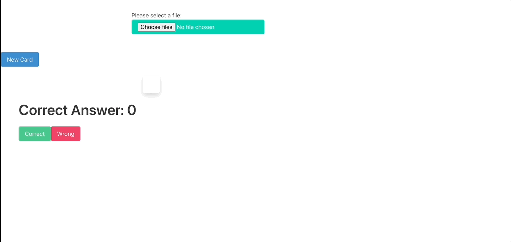
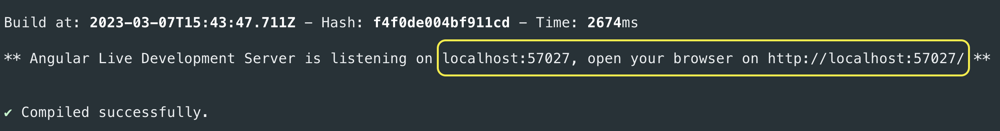

<div align="center">

# Study Cards 


Study Cards is a **small app**, developed in Angular.

You can upload a XLS and the app its going to read the first 2 columns creating randomly a flashcard.<br />


[Preview](#preview) •
[Installation](#installation) •
[Integrations](#third-party-integrations)

</div>

# Preview


# Installation

After download the project you have to be on the root folder and execute on the terminal the command 'npm install'

```properties
Your User: ~/Documents/StudyApp/studyApp npm install
```  

Secondly have to use the commando 'ng s' or 'ng serve'
```properties
Your User: ~/Documents/StudyApp/studyApp ng server
```  
OR 
```properties
Your User: ~/Documents/StudyApp/studyApp ng s
```  
When the server is already running the console its going to show you the url and port to have access




# Third party integrations

[This app it's using the NGX-FLIP-CARD](https://github.com/SpecialOne88/angular-libraries/tree/master/projects/ngx-flip-card "NGX flip card repo") <br> Thanks to [SpecialOne88](https://github.com/SpecialOne88)

